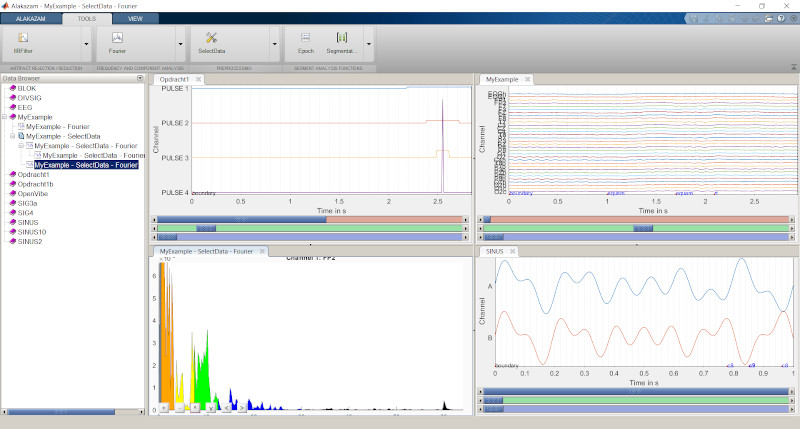

# Alakazam: A Modular EEG/ECG Analysis Software Package in MATLAB



## Overview

Alakazam is a developing software package designed to provide a user-friendly interface for performing EEG (electroencephalogram) or ECG (electrocardiogram) analysis within MATLAB. The goal is to streamline and enhance the process of analyzing timeseries data through a modular and interactive platform. This project is currently a work in progress, and contributions are welcome.

### Key Features

1. **User Interface Design**: The interface is modeled after the [Toolgroup demo](http://undocumentedmatlab.com/articles/matlab-toolstrip-part-2-toolgroup-app) and draws significant inspiration from the [Brainvision Analyser](https://www.brainproducts.com/promo_analyzer2.php) interface. This ensures a familiar and intuitive user experience for those already acquainted with similar tools.

2. **Time Series Plotting**: For visualizing EEG data, Alakazam leverages the [plotECG](https://nl.mathworks.com/matlabcentral/fileexchange/59296-daniel-frisch-kit-plot-ecg) tool by Daniel Frisch, which provides robust and flexible time series plotting capabilities.

3. **Data Structure**: The core data structure used in Alakazam is the "EEG" structure from [EEGLAB](https://sccn.ucsd.edu/eeglab/index.php). This ensures compatibility with existing EEGLAB functions and workflows. Additionally, Alakazam extends this structure by adding extra information when saving its own .mat files, thereby enhancing data management and retrieval.

4. **Transformations**: One of the core aspects of Alakazam is the ability to add and manage computational transformations. Users can look into the "Transformations" directory to understand the framework for adding new computations to the package. This modular approach allows users to customize and extend the functionality to suit specific analysis needs.

### GitHub Repository

The Alakazam project is hosted on GitHub, where you can find the source code, contribute to its development, and report issues. Visit the project repository here: [Alakazam GitHub Repository](https://github.com/markspan/Alakazam)

## Example Transformation

Below is an example transformation that demonstrates how to call an EEGLAB function within Alakazam. Transformations should return the transformed data within the EEG structure and an options variable that the function can understand.

```matlab
function [EEG, options] = SelectData(input, opts)
%% Example Transformation using an EEGLAB function
% Transformations should return the transformed data in the EEG structure,
% and an options variable ("options") that the function can understand.
% In this case, as we use an EEGLAB function, the commandline history is returned.
% Input must (in principle) contain a data structure (EEG), and optionally
% the options variable obtained from a previous call. If this second
% variable is available, no user interaction takes place, but the
% Transformation is performed based on the given options. This second form
% occurs when the transformation is dragged in the tree up to another
% dataset.

    %% Check for the EEG dataset input
    if (nargin < 1)
        ME = MException('Alakazam:SelectData', 'Problem in SelectData: No Data Supplied');
        throw(ME);
    end

    %% Determine if the call was made from the menu
    if (nargin == 1)
        options = 'Init';
    else
        options = opts;
    end

    EEG = input;
    
    %% If it was a menu call, use the interactive version of the transformation
    % in this case, the pop_select version.
    if (ischar(options))
        if (strcmpi(options, 'Init'))
            [EEG, options] = pop_select(input);
            % In EEGLAB, the second return value is the function call to recreate the
            % transformation.
        end
    else
        eval(options.Param);
        % Evaluating this return value will recreate the transformation on the "EEG" structure.
    end
end
```

This example demonstrates how to integrate existing EEGLAB functionality within Alakazam, maintaining compatibility and leveraging the robust features of EEGLAB for EEG data analysis.
