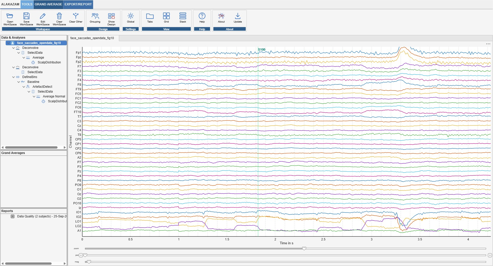
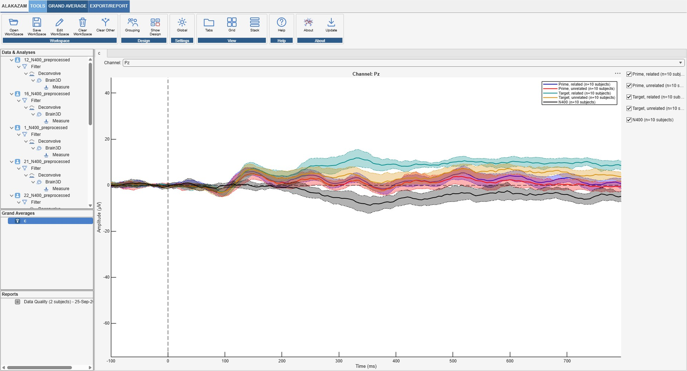
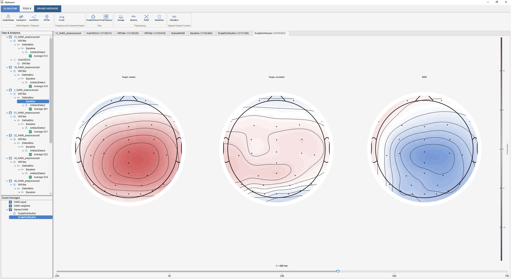
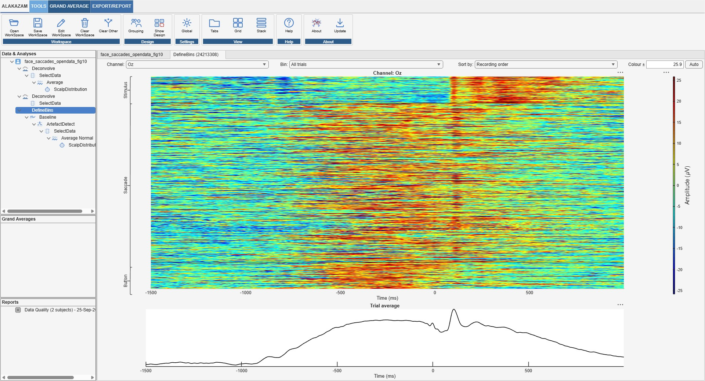
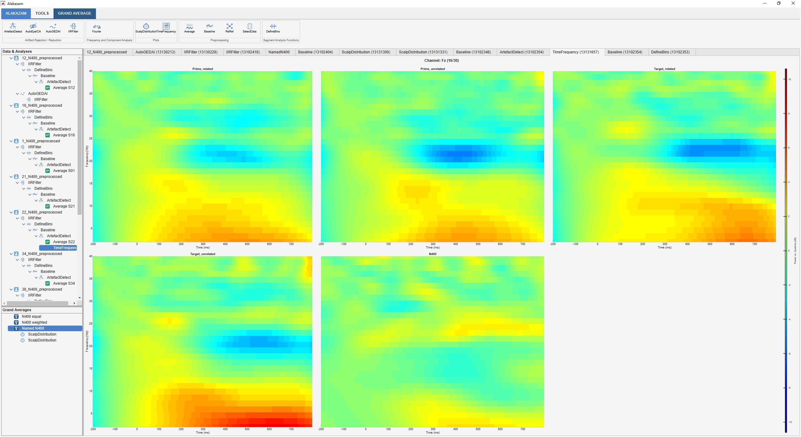

# Alakazam

An interactive MATLAB workbench for EEG and event-related potential (ERP)
analysis.



## Overview

Alakazam is a desktop application for EEG researchers: it loads a recording,
lets the analyst apply a sequence of processing steps to it, and keeps the
full processing history as an explorable tree rather than a one-off script
result. It is built directly on the EEGLAB `EEG` data structure, so any
result can be handed off to the wider EEGLAB/ERPLAB ecosystem, and it
presents a "tree of datasets plus draggable transformations" workflow
inspired by commercial analysers such as BrainVision Analyzer: each
recording is a root node; every processing step (filtering, re-referencing,
epoching, artefact removal, averaging, ...) produces a new child node.

The methodological approach follows established, reproducible ERP/EEG
practice as described in Steven J. Luck's open textbook *Applied
Event-Related Potential Data Analysis* (see [References](#references)).

## Key features

- **EEGLAB-native data model.** Datasets are EEGLAB `EEG` structures, extended
  with a few Alakazam fields (`File`, `id`, `Call`, `params`, `DataType`,
  `DataFormat`) that record provenance and how each result was produced.
- **Two dataset trees with draggable, replayable transformations.** A
  "Data & Analyses" tree holds each recording as a root node with its
  analysis history as an explorable tree of child nodes; a separate "Grand
  Averages" tree holds combined results, which don't belong nested under any
  single subject. Applying a transformation to the selected dataset creates
  a new child node; dragging a processed branch onto another dataset
  re-applies the same chain of steps to it.
- **Format support.** BrainVision (`.vhdr`, via the bva-io EEGLAB plugin),
  EEGLAB `.set`, and previously-saved Alakazam `.mat` sessions. Each raw file
  is cached to `.mat` on first read and only re-parsed if the raw file is
  newer than its cache.
- **Fast visualisation of long recordings.** Continuous signals are drawn by
  a purpose-built renderer that decimates through a precomputed min/max
  pyramid, so scrolling and zooming stay smooth on multi-hour,
  multi-channel data while every spike and artefact remains visible (see
  [Fast plotting](#fast-plotting)).
- **Tabbed or tiled plot views.** Open datasets show one at a time as tabs,
  or all at once arranged in a grid or stacked column, for side-by-side
  comparison.
- **A transformation library covering the standard EEG/ERP pipeline**:
  filtering, re-referencing, channel/data selection, event-to-bin
  assignment with a small purpose-built language, baseline correction,
  trial averaging (including bin-difference/interaction contrasts),
  amplitude-threshold artefact marking, automated ICA- and GEDAI-based
  artefact removal, Fourier analysis, and scalp topography plots (see
  [Transformations](#transformations)); grand averaging across subjects is
  a separate mechanism with its own tree and dialog.
- **Session workspaces.** Working directories and the processing tree are
  saved and reloaded as a workspace.

## Architecture

A single `uifigure` hosts the whole application: a control-strip ribbon
along the top (Home/Tools/Grand Average tabs, discovering transformations
automatically), the two dataset trees on the left, and the plots area on
the right (tabbed or tiled, see above). Authored application code lives
under `src/`; third-party toolkits and shared data-file resources stay at
the repository root. See [`PROJECT_STRUCTURE.md`](PROJECT_STRUCTURE.md) for
the full map (including which pieces are build-time-only, like the Node.js
tooling behind the tree widget) and [`dependencies.md`](dependencies.md)
for the external toolkits.

At startup the application resolves two roots from its own file location, so
it does not depend on the current working directory:

- `RootDir` is the authored source tree (`src/`), holding the transformations.
- `RepoRoot` is the repository root, holding the vendored toolkits and resources.

> The ribbon and dataset trees are custom `uihtml` components, not MathWorks'
> own Toolstrip/tree widgets: an earlier version of Alakazam docked plot
> windows into a Java-Swing desktop shell, which stopped working once modern
> MATLAB releases moved `figure()` off Java Swing entirely. See
> [`migration.md`](migration.md) for that history, if you're curious why the
> UI is built the way it is.

## Fast plotting

Continuous time-series are drawn by `SignalView`, backed by `MinMaxPyramid`.
The pyramid precomputes, once, a stack of increasingly coarse levels that
store the per-bucket minimum and maximum of the signal. A redraw then reads
about one min/max column per screen pixel from the nearest level (or the
raw samples when the visible window already fits the axis), so its cost is
independent of the recording length. Because minima and maxima compose
exactly, the decimated envelope never hides a spike or a brief artefact.
The view provides pan, zoom, and y-axis magnify controls, mouse-wheel
scrolling, channel stacking, and overlays for events and marked artefacts.

## Getting started

Requirements: MATLAB (with `uifigure`/App Designer support -- the UI is built
entirely on that component family, not the classic figure/uicontrol one), the
Signal Processing Toolbox (IIR filtering in `IIRFilter`, the taper windows in
`Fourier`) and the Statistics and Machine Learning Toolbox (used by EEGLAB and
some of its plugins), plus the external toolkits listed in
[`dependencies.md`](dependencies.md), most importantly EEGLAB. Parallel
Computing Toolbox is advised (not required) for the AutoGEDAI transformation:
its GEDAI plugin dependency uses GPU acceleration when a GPU is actually
detected, and falls back to CPU (via a small compatibility shim,
`src/Compat/gpuDeviceCount.m`, on a machine without the toolbox at all)
otherwise, so a machine without a GPU is just slower, not broken.

```matlab
% From the repository root:
startAlakazam        % adds src/ to the path and opens the application
```

`startAlakazam` adds the authored source tree to the MATLAB path and constructs
the app, which in turn adds the vendored toolkits from the repository root. On
first run, EEGLAB is initialised if it is not already on the path (the global
MATLAB path is left unchanged). At startup, `EEGLabEnvironment` also checks for
the Signal Processing and Statistics and Machine Learning toolboxes and warns
(without blocking startup) if either is missing.

## Transformations

A transformation is a small plugin in `src/Transformations/<Name>/`, consisting
of an entry function `<Name>.m`, a JSON manifest `<Name>.json` (name, section,
category, icon), and an icon. Manifests are discovered automatically and placed
in the ribbon's Tools tab, grouped by the manifest's `Section` field.

A transformation receives an `EEG` structure and returns the transformed `EEG`
together with an `options` value describing what it did. When called
interactively (from the ribbon) it may prompt the user; when called with a
previously captured `options` value (when a branch is dragged onto another
dataset) it reproduces the operation without interaction. For transformations
that wrap EEGLAB `pop_*` functions, that stored value is EEGLAB's own command
history, which is replayed with `eval`; this is a deliberate part of the plugin
system rather than an oversight.

```matlab
function [EEG, options] = SelectData(input, opts)
% Example transformation that wraps an EEGLAB function.
% Returns the transformed EEG and an options value the function understands.

    if nargin < 1
        error("Alakazam:SelectData", "No data supplied");
    end

    if nargin == 1
        options = "Init";   % interactive call from the ribbon
    else
        options = opts;     % re-apply a previously captured operation
    end

    EEG = input;

    if ischar(options) || isstring(options)
        if strcmpi(options, "Init")
            % Interactive: EEGLAB returns the command history as options.
            [EEG, options] = pop_select(input);
        end
    else
        % Re-apply: replay the captured EEGLAB command on this EEG.
        eval(options.Param);
    end
end
```

The current library:

| Transformation | Does |
|---|---|
| `IIRFilter` | IIR (Butterworth) low-pass/high-pass/band-stop filtering, per channel or globally. |
| `ReRef` | Re-references the data (wraps `pop_reref`). |
| `SelectData` | Channel and/or time-range selection (wraps `pop_select`). |
| `DefineBins` | Assigns events to ERP bins with a small, purpose-built event-selection language -- see [`bin_language.md`](src/Transformations/DefineBins/bin_language.md) for the full reference. Replaces the ERPLAB EVENTLIST + BINLISTER step. |
| `Baseline` | Baseline-corrects epoched data. |
| `Average` | Averages one dataset's epoched trials into an ERP, including bin-difference/interaction contrast bins (see `bin_language.md` §11-12). |
| `ArtefactDetect` | Flags epochs exceeding an absolute amplitude threshold. |
| `AutoEyeICA` | Runs ICA, classifies components with ICLabel, and automatically removes eye components above a probability threshold. |
| `AutoGEDAI` | Denoises with GEDAI (generalized eigenvalue decomposition against a leadfield reference; Ros et al., 2025). |
| `Fourier` | FFT-based frequency-domain analysis, with windowing and resolution options. |
| `ScalpDistribution` | Scrubbable scalp-topography plot of an averaged ERP over a time window. |

Grand averaging (combining several subjects' `Average` results into one) is
a separate mechanism, not a transformation plugin: it has its own ribbon tab
and dialog (`GrandAverage.m`/`GrandAverageDialog.m`) and lands in the
"Grand Averages" tree rather than nested under any one subject's branch
(see [Key features](#key-features)).









## References

Scientific/methodological:

- Luck, S. J. *Applied Event-Related Potential Data Analysis*. LibreTexts.
  [socialsci.libretexts.org](https://socialsci.libretexts.org/Bookshelves/Psychology/Biological_Psychology/Applied_Event-Related_Potential_Data_Analysis_(Luck)).
  DOI: [10.18115/D5QG92](https://doi.org/10.18115/D5QG92). Licensed CC BY 4.0.
  A practical, EEGLAB/ERPLAB-based reference for the preprocessing, averaging, and
  scoring steps that Alakazam's transformations implement.
- Lopez-Calderon, J., & Luck, S. J. (2014). ERPLAB: an open-source toolbox for
  the analysis of event-related potentials. *Frontiers in Human Neuroscience*,
  8, 213. [erpinfo.org/erplab](https://erpinfo.org/erplab). The methodological
  model for `DefineBins` (event-to-bin assignment, replacing EVENTLIST +
  BINLISTER), `Average`'s contrast-bin handling, and `GrandAverage`'s
  weighted grand-average option; not a runtime dependency, ERPLAB itself is
  not called.
- Ros, T., et al. (2025). GEDAI: generalized eigenvalue decomposition for
  automated EEG artefact removal.
  [github.com/neurotuning/GEDAI-master](https://github.com/neurotuning/GEDAI-master).
  Used by the `AutoGEDAI` transformation.
- Pion-Tonachini, L., Kreutz-Delgado, K., & Makeig, S. (2019). ICLabel: An
  automated electroencephalographic independent component classifier,
  dataset, and website. *NeuroImage*, 198, 181-197. Used by `AutoEyeICA` to
  classify and remove eye components.
- Hyvärinen, A., & Oja, E. (2000). Independent component analysis:
  algorithms and applications. *Neural Networks*, 13(4-5), 411-430. FastICA,
  [research.ics.aalto.fi/ica/fastica](https://research.ics.aalto.fi/ica/fastica/).
  Used by `AutoEyeICA` when installed (falls back to `pop_runica`'s own
  default algorithm otherwise).
- Delorme, A., & Makeig, S. (2004). EEGLAB: an open source toolbox for
  analysis of single-trial EEG dynamics. *Journal of Neuroscience Methods*,
  134(1), 9-21. [sccn.ucsd.edu/eeglab](https://sccn.ucsd.edu/eeglab/index.php).
  The data structure and plugin ecosystem (including the bva-io BrainVision
  import plugin and ICLabel above) Alakazam is built on.
- BrainVision Analyzer, the commercial analyser whose interaction model
  inspired Alakazam.
  [brainproducts.com](https://www.brainproducts.com/promo_analyzer2.php).

Software toolkits (see [`dependencies.md`](dependencies.md) for the complete,
versioned list):

- GUI Layout Toolbox (R. Jackey, MathWorks) -- dialog widgets used throughout
  the transformations' option dialogs, vendored at `src/+uiextras/`.
- mlapptools (StackOverflow MATLAB chat community).
  [github.com/StackOverflowMATLABchat/mlapptools](https://github.com/StackOverflowMATLABchat/mlapptools).
  uifigure styling for the `IIRFilter` transformation's App Designer dialog.
- MATLAB Toolstrip / ToolGroup demo by R. Chen.
  [undocumentedmatlab.com](http://undocumentedmatlab.com/articles/matlab-toolstrip-part-2-toolgroup-app).
  Historical: the app shell this originally adapted has since been replaced by
  a single `uifigure` with a custom `uihtml` ribbon (see
  [Architecture](#architecture) and [`migration.md`](migration.md)); kept here
  as a credit to the original adapted code, not a description of the current UI.

## Repository

Source, issues, and contributions:
[github.com/markspan/Alakazam](https://github.com/markspan/Alakazam). Alakazam is
a work in progress and contributions are welcome.

## License

See [LICENSE](LICENSE) (GPL).
