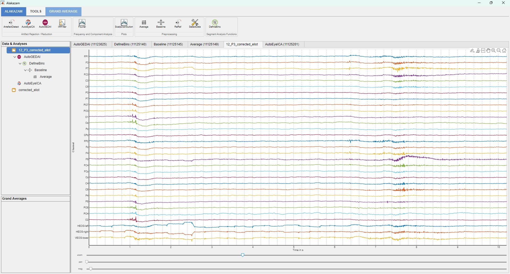

# Alakazam

A modular, interactive workbench for EEG and peripheral physiology analysis in MATLAB.



## Overview

Alakazam is a desktop application for exploring and processing electrophysiological
recordings: EEG and event-related potentials (ERPs), together with the peripheral
signals that often accompany them (ECG and heart-rate variability, impedance
cardiography and pre-ejection period, respiration, blood pressure, and
electrodermal activity).

It is built around the EEGLAB `EEG` data structure, so it interoperates with the
wider EEGLAB ecosystem, and it presents a "tree of datasets plus draggable
transformations" workflow inspired by commercial analysers such as BrainVision
Analyzer. Each recording is loaded as a root node; every analysis step is a
transformation that produces a new child node, so a full processing history is
kept as an explorable tree rather than a one-off script result.

The methodological approach follows established, reproducible ERP/EEG practice as
described in Steven J. Luck's open textbook *Applied Event-Related Potential Data
Analysis* (see [References](#references)).

## Key features

- **EEGLAB-native data model.** Datasets are EEGLAB `EEG` structures, extended
  with a few Alakazam fields (`File`, `id`, `Call`, `params`, `DataType`,
  `DataFormat`) that record provenance and how each result was produced.
- **Dataset tree with draggable transformations.** Apply a transformation to the
  selected dataset to create a new child node; drag a processed branch onto
  another dataset to re-apply the same chain of steps to it.
- **Broad format support.** Loaders for XDF, VU-AMS EDF, CARSPAN, BrainVision,
  Cortrium C3, TMSi Poly5, EEGLAB `.set`, and Alakazam `.mat` sessions.
- **Fast visualisation of long recordings.** Continuous signals are drawn by a
  purpose-built renderer that decimates through a precomputed min/max pyramid, so
  scrolling and zooming stay smooth on multi-hour, multi-channel data while every
  spike and artefact remains visible (see [Fast plotting](#fast-plotting)).
- **Extensible transformation library.** Filtering, re-referencing, epoching,
  averaging, ICA, artefact detection, Fourier and time-frequency analysis,
  Poincare / HRV metrics, EMG, ICG/PEP, and respiration, each a self-contained
  plugin (see [Transformations](#transformations)).
- **Session workspaces.** Working directories and the processing tree are saved
  and reloaded as a workspace.

## Architecture

Authored application code lives under `src/`; third-party toolkits and shared
data-file resources stay at the repository root. See
[`PROJECT_STRUCTURE.md`](PROJECT_STRUCTURE.md) for the full map and
[`dependencies.md`](dependencies.md) for the external toolkits (EEGLAB, Ledalab,
the Vollmer HRV toolbox, GUI Layout Toolbox, and the device SDKs).

At startup the application resolves two roots from its own file location, so it
does not depend on the current working directory:

- `RootDir` is the authored source tree (`src/`), holding the transformations,
  icons, and the default workspace.
- `RepoRoot` is the repository root, holding the vendored toolkits and resources.

## Fast plotting

Continuous time-series are drawn by `SignalView`, backed by `MinMaxPyramid`.
The pyramid precomputes, once, a stack of increasingly coarse levels that store
the per-bucket minimum and maximum of the signal. A redraw then reads about one
min/max column per screen pixel from the nearest level (or the raw samples when
the visible window already fits the axis), so its cost is independent of the
recording length. Because minima and maxima compose exactly, the decimated
envelope never hides a spike or a brief artefact. The view provides pan, zoom,
and y-axis magnify controls, mouse-wheel scrolling, channel stacking, and
overlays for interbeat intervals and events.

## Getting started

Requirements: MATLAB (with the App Designer / toolstrip components) and the
external toolkits listed in [`dependencies.md`](dependencies.md), most importantly
EEGLAB.

```matlab
% From the repository root:
startAlakazam        % adds src/ to the path and opens the application
```

`startAlakazam` adds the authored source tree to the MATLAB path and constructs
the app, which in turn adds the vendored toolkits from the repository root. On
first run, EEGLAB is initialised if it is not already on the path (the global
MATLAB path is left unchanged).

## Transformations

A transformation is a small plugin in `src/Transformations/<Name>/`, consisting
of an entry function `<Name>.m`, a JSON manifest `<Name>.json` (name, section,
category, icon), and an icon. Manifests are discovered automatically and placed
in the toolstrip gallery.

A transformation receives an `EEG` structure and returns the transformed `EEG`
together with an `options` value describing what it did. When called
interactively (from the gallery) it may prompt the user; when called with a
previously captured `options` value (when a branch is dragged onto another
dataset) it reproduces the operation without interaction. For transformations
that wrap EEGLAB `pop_*` functions, that stored value is EEGLAB's own command
history, which is replayed with `eval`; this is a deliberate part of the plugin
system rather than an oversight.

```matlab
function [EEG, options] = SelectData(input, opts)
% Example transformation that wraps an EEGLAB function.
% Returns the transformed EEG and an options value the function understands.

    if nargin < 1
        error("Alakazam:SelectData", "No data supplied");
    end

    if nargin == 1
        options = "Init";   % interactive call from the gallery
    else
        options = opts;     % re-apply a previously captured operation
    end

    EEG = input;

    if ischar(options) || isstring(options)
        if strcmpi(options, "Init")
            % Interactive: EEGLAB returns the command history as options.
            [EEG, options] = pop_select(input);
        end
    else
        % Re-apply: replay the captured EEGLAB command on this EEG.
        eval(options.Param);
    end
end
```

## References

- Luck, S. J. *Applied Event-Related Potential Data Analysis*. LibreTexts.
  [socialsci.libretexts.org](https://socialsci.libretexts.org/Bookshelves/Psychology/Biological_Psychology/Applied_Event-Related_Potential_Data_Analysis_(Luck)).
  DOI: [10.18115/D5QG92](https://doi.org/10.18115/D5QG92). Licensed CC BY 4.0.
  A practical, EEGLAB/ERPLAB-based reference for the preprocessing, averaging, and
  scoring steps that Alakazam's transformations implement.
- Delorme, A., & Makeig, S. EEGLAB. [sccn.ucsd.edu/eeglab](https://sccn.ucsd.edu/eeglab/index.php).
- BrainVision Analyzer, the commercial analyser whose interaction model inspired
  Alakazam. [brainproducts.com](https://www.brainproducts.com/promo_analyzer2.php).
- MATLAB Toolstrip / ToolGroup demo by R. Chen.
  [undocumentedmatlab.com](http://undocumentedmatlab.com/articles/matlab-toolstrip-part-2-toolgroup-app).

## Repository

Source, issues, and contributions:
[github.com/markspan/Alakazam](https://github.com/markspan/Alakazam). Alakazam is
a work in progress and contributions are welcome.

## License

See [LICENSE](LICENSE) (GPL).
