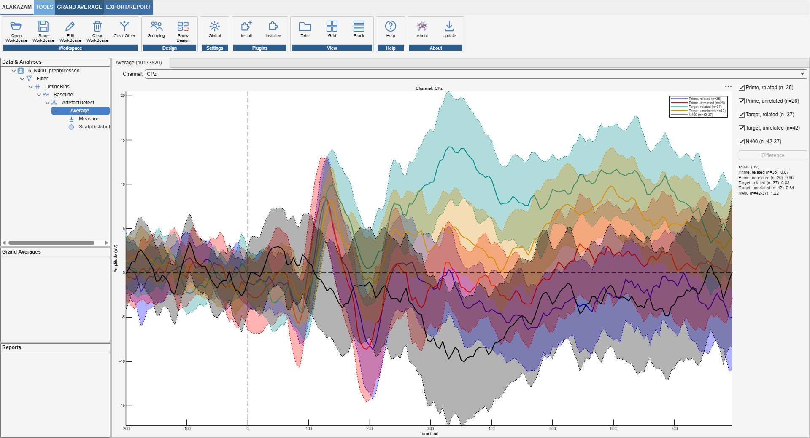
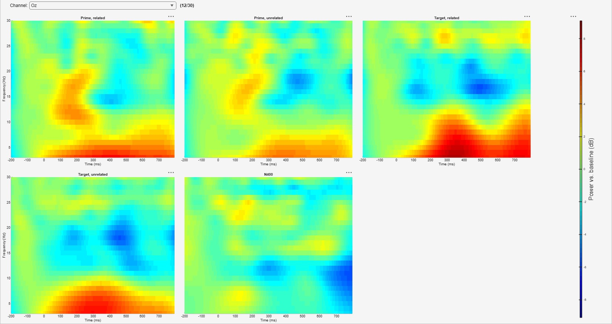
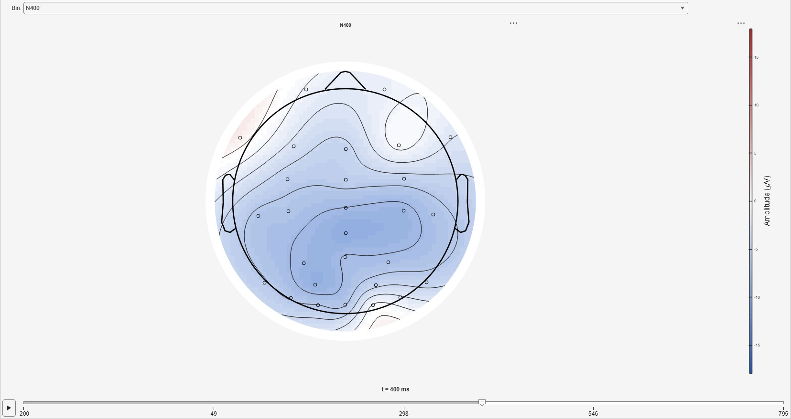
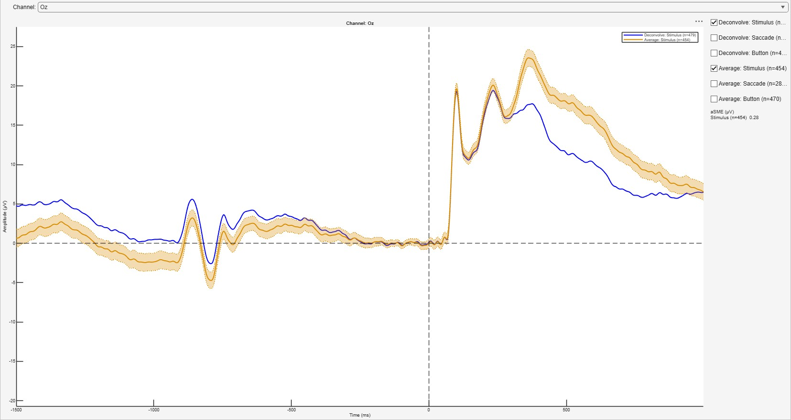

# Alakazam

**An interactive MATLAB workbench for EEG and ERP analysis, made for learning
the methods and for reusing the analysis.**



Alakazam loads an EEG recording, applies processing steps to it one at a
time, and keeps every result as a node in a tree: what was done, with which
settings, and in what order. Nothing is a one-off. Every step can be looked
at, changed, replayed on the next recording, saved as a template, or written
out as a MATLAB script.

**[Read the manual](https://markspan.github.io/Alakazam/)** ([PDF](manual/manual.pdf)) · [Download a release](https://github.com/markspan/Alakazam/releases) · [Example data](DATA.md)

## Made for education and for reuse

The focus of Alakazam is on **education** and on **reusability in research**.

### For learning the methods

- **See what every step does.** Each step of an ERP analysis is a button
  with a dialog that names its settings, and each result is a plot one click
  away, so the effect of a filter, a reference or a rejection threshold is
  seen rather than taken on trust.
- **Try the alternative beside the original.** A second choice does not
  replace the first: it becomes a second branch of the tree, and the two
  results can be compared side by side.
- **Follow the textbook in the application.** The ERP CORE chapters of
  Steven Luck's open textbook, *Applied Event-Related Potential Data
  Analysis*, come as ready-made templates ([`library/templates/luck/`](library/templates/luck/README.md)),
  on the same data the book uses.
- **Follow a published protocol.** The workflow is the one Pütz, Span &
  Lorist (2025) set out step by step in *STAR Protocols*, from designing and
  recording an ERP task to preprocessing it and exporting the measures for
  statistical analysis
  ([doi:10.1016/j.xpro.2025.103835](https://doi.org/10.1016/j.xpro.2025.103835)).
- **Understand why, not only how.** The [manual](manual/manual.pdf)
  explains what each step computes, with which defaults and on what
  grounds, with the literature behind it. The same manual is behind the
  **Help** button.
- **From clicking to programming.** **Export as Code** turns a pipeline
  built in the interface into a readable MATLAB script, written as the
  EEGLAB calls it corresponds to wherever that is a faithful translation.
  **Export as FieldTrip** writes the same analysis in FieldTrip's own
  functions, every step marked as exact, read back, or not translated.

### For reusable research

- **A pipeline is recorded, not remembered.** Drag a processed branch onto
  another recording, or use **Apply to All Raw Files**, and the same steps
  with the same settings run on every participant.
- **Templates travel.** A template (`.alztemplate`, plain JSON) carries a
  pipeline to another workspace, another study or another lab.
- **Open data structures.** Every dataset is an EEGLAB `EEG` structure, so
  it can be handed to EEGLAB, ERPLAB or FieldTrip unchanged. Raw files are
  never modified.
- **Reports you can read and edit.** The statistics are Quarto documents
  with R underneath, not a fixed printout, and the data-quality report
  states what each cleaning step did to each participant.
- **Checked against published results.** The ERP pipeline was compared
  step by step with ERPLAB on the textbook's data, and the frequency-tagging
  analysis with a published RIFT study, and the dipole fit and beamformer
  with FieldTrip's tutorials; how close each comparison comes is written
  down in [`Docs/luck.md`](Docs/luck.md), [`Docs/dimigen.md`](Docs/dimigen.md)
  and [`Docs/fieldtrip.md`](Docs/fieldtrip.md).

## What it does

- **The ERP pipeline**: filtering, re-referencing, channel repair,
  artefact rejection and correction (ICA with ICLabel, GEDAI), epoching,
  baseline correction, averaging, and amplitude, area and latency
  measures.
- **Conditions in a few readable lines.** Bins are described in a small
  language rather than a spreadsheet:

  ```
  % Targets count only when a correct response (201) follows in 200-1500 ms.
  epoch [-200,800] ms
  bin 1 "Target, related"   : 211|212 and next(201) within [200,1500] ms
  bin 2 "Target, unrelated" : 221|222 and next(201) within [200,1500] ms
  bin 3 "N400" = bin 2 - bin 1
  ```

- **Statistics that fit the design**: reports that choose the test the
  design calls for, from paired *t*-tests to linear mixed models, with
  Bayes factors and effect sizes, and cluster-based permutation tests over
  the scalp or the cortical surface.
- **Data quality**: trial loss per participant and condition, noise, the
  standardised measurement error and the dependability of each score.
- **Frequency tagging**: power, signal-to-noise ratio, phase-locking and
  coherence for steady-state and rapid invisible frequency tagging designs.
- **Overlapping responses**: regression-based deconvolution (Unfold) for
  free viewing, reading and fast presentation, and co-registration with an
  eye tracker (EYE-EEG).
- **Source estimation** on a template cortex (FieldTrip), with the limits of
  such an estimate stated beside it.
- **Long recordings stay fast**: a purpose-built viewer scrolls hours of
  multichannel data smoothly without hiding a single artefact.

<table>
<tr>
<td width="33%"></td>
<td width="33%"></td>
<td width="33%"></td>
</tr>
<tr>
<td>Time-frequency power per condition.</td>
<td>Scalp distributions over time.</td>
<td>Overlap-corrected ERPs by deconvolution.</td>
</tr>
</table>

## Getting started

You need MATLAB (a recent release, with `uifigure` support), the Signal
Processing Toolbox and the Statistics and Machine Learning Toolbox.
EEGLAB is set up by Alakazam on first run; other toolboxes (ICLabel, FieldTrip,
Unfold, EYE-EEG, GEDAI) are installed the first time a step needs them,
after asking. For the statistical reports you also need Quarto and R
(Quarto comes with RStudio).

Clone the repository, or download a packaged release from the
[releases page](https://github.com/markspan/Alakazam/releases), then in
MATLAB, from the Alakazam folder:

```matlab
startAlakazam
```

Point the workspace at a folder of recordings (EEGLAB `.set`, BrainVision
`.vhdr` or ERPLAB `.erp`), or start with the openly available example data
listed in [`DATA.md`](DATA.md). The manual's *Getting started* chapter walks
through a first analysis, from a raw recording to numbers you can analyse.

## Documentation

| Document | For |
|---|---|
| [The manual](https://markspan.github.io/Alakazam/) ([PDF](manual/manual.pdf), [source](manual/manual.qmd)) | Researchers and students: every step, report and setting, with its background. Also behind the **Help** button. |
| [`DATA.md`](DATA.md) | Where to get the example datasets the manual and templates use. |
| [`library/`](library/README.md) | Ready-made templates, bin scripts and measurement windows. |
| [`library/templates/luck/`](library/templates/luck/README.md) | The textbook chapters as templates. |
| [`dependencies.md`](dependencies.md) | The toolkits Alakazam uses, their versions and licences. |
| [`DEVELOPER.md`](DEVELOPER.md) | Contributors: the architecture, adding a transformation, the tests. |
| [`CHANGELOG.md`](CHANGELOG.md) | What changed in each release. |

## Citing

When you publish an analysis made with Alakazam, cite the methods it used:
EEGLAB for the data structure and the functions it wraps, and the specific
methods named in the manual's section on each step (ICLabel, Unfold,
FieldTrip and so on). **Export as Code** writes the complete pipeline with
the settings actually used, which is the most precise methods description
there is. The **About** box lists the papers and the version you ran.

## Licence

Alakazam is free software under the GNU General Public License, version 3
(see [`LICENSE`](LICENSE)). The toolboxes it installs on first use keep
their own licences, listed in [`dependencies.md`](dependencies.md); note
that GEDAI's allows noncommercial research use only.

Source, issues and contributions:
[github.com/markspan/Alakazam](https://github.com/markspan/Alakazam).
